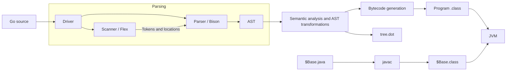

# JGolangCompiler

An educational compiler for a subset of Go, written in C++17 with Flex and Bison. It generates JVM `.class` files and uses a small Java runtime for built-in operations.

## Build and run

The development image includes the compiler toolchain, OpenJDK 21, Go and Python. From the repository root:

```sh
docker build --target dev -t jgolangcompiler-dev .
docker run --rm -it --mount "type=bind,source=$(pwd),target=/src" jgolangcompiler-dev bash
```

Run the following commands from the repository root inside the container:

```sh
cmake -S . -B build-linux
cmake --build build-linux --parallel

./build-linux/compiler tests/cases/functions/hello_world.go
javac -d output 'RTL/$Base.java'
java -cp output '$functions'
```

The compiler writes to `output/` relative to the current directory. The generated class is named `$<package>`: this example declares `package functions`, so its class is `$functions`. Keep the single quotes to prevent shell variable expansion.

`javac` compiles the runtime into the same directory. JVM calls to built-ins such as `println` and `append` are implemented by `$Base.class`.

For a local build without Docker, install CMake 3.15+, a C++17 compiler, Flex and Bison 3.8.2+. Tests also require Python 3.10+, Go, JDK 18+ and `diff`. Configure with `-DBUILD_TESTING=OFF` to build only the compiler; Java is still needed to run its output.

## Compilation pipeline



## Language support

| Area | Implemented features |
| --- | --- |
| Declarations | Variables, constants, short declarations, multiple assignment, blank identifier |
| Expressions | Numeric, string and boolean values; arithmetic, comparisons, logical operators, increments and compound assignment |
| Control flow | `if`/`else`, conditional and three-part `for`, infinite loops, array/slice `range`, `break`, `continue`, `switch`, `fallthrough` |
| Functions | Package-level functions with parameters and zero or one return value |
| Arrays and slices | Literals, indexing, element assignment, nested arrays and slices |
| Built-ins | `print`, `println`, `len`, `append`, and the project-specific `readInt`, `readFloat`, `readString`, `readBool` |

Support is partial; the tests cover selected programs rather than full Go compatibility.

## Tests

```sh
ctest --test-dir build-linux --output-on-failure
```

Tests check parsing of control-flow headers, AST ownership during transformations, and algorithm output against Go using `diff`. Other files in `tests/cases/` are examples for manual checks.

## Limitations and next steps

- Compilation processes one source file with a `main` function. Imports and the Go standard library are not supported.
- Structs, methods, interfaces, user-defined types and function literals have partial grammar support but cannot all be compiled and executed.
- Pointers, maps, goroutines, channels, `select`, `defer` and generics are not supported.
- Integer types and `rune` use JVM `int`; both floating-point types use JVM `float`.
- Arrays and slices use JVM arrays. Array cloning is shallow, so nested value arrays do not yet have Go's copying semantics. Slice length, capacity and shared storage are not fully modeled.
- `print` and `println` take one argument; `append` adds one element.

Next steps are to define array and slice copying rules, add focused semantic tests, and introduce stable AST snapshots for parser tests.
